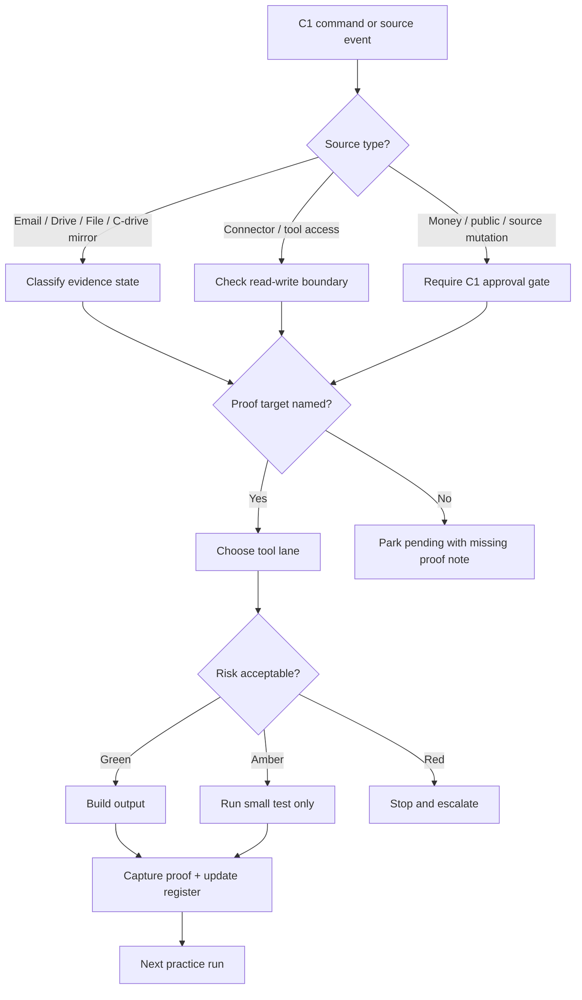
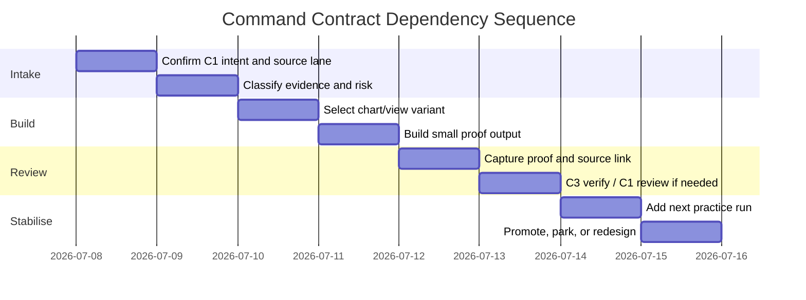
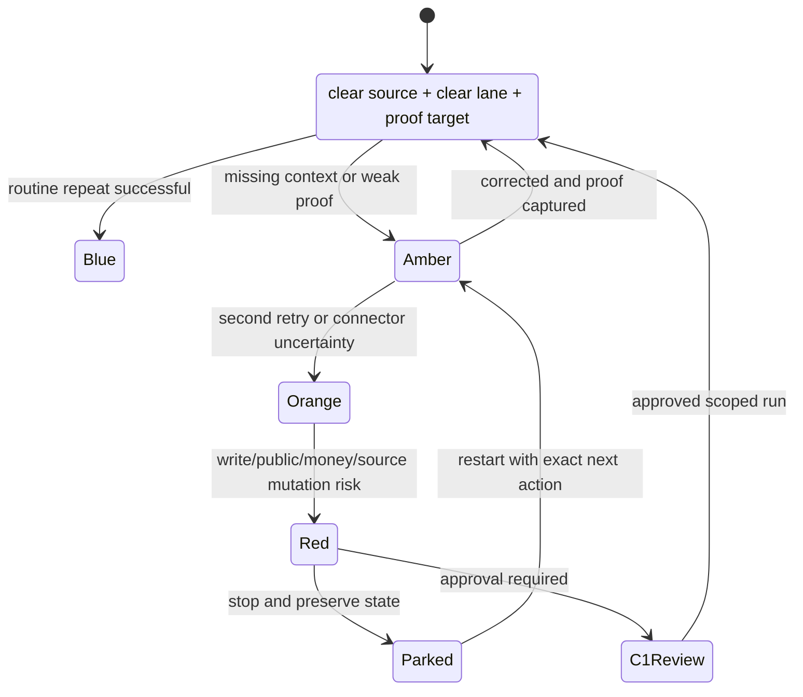
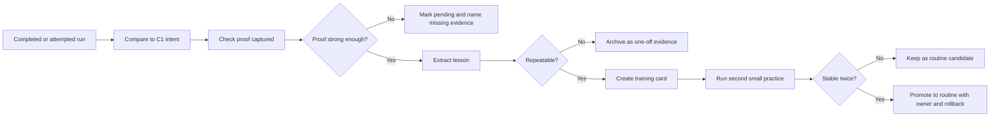

# MLMF 160 Command Contracts — Five-Variant Flow Pack v0.2

Authority: C1 Tommy  
Prepared by: C3 Adam  
Date: 2026-07-08  
Status: Draft / Proposed / Pending C1 Review  
Storage base: C3_ADAM_CONTROL_BASE__MLMF_VISUAL_ATLAS_AND_COMMAND_CONTRACTS__2026-07-08

C3 Drive Grounding: Google Drive is my governed working drive lane under C1 authority. I use it to control the structure, preserve source/proof, track where I am up to, and keep MLMF information recoverable. No source truth is overwritten silently.

## What changed
The original 160 are real source evidence, but many share a useful repeated skeleton. This pack does not delete that skeleton. It turns the skeleton into five different command-contract flow variants so the stack is not stuck with three boxes pointing at each other.

## V1 — Multi-router command contract
Use for C02, C08, C14. Routes by source type, risk, connector permission, proof target, output destination, and stop condition.



## V2 — Gantt dependency command contract
Use for C10 and any timeline/order view. It prevents random chart production by forcing sequence, dependency, owner, and proof.



## V3 — Rainbow status command contract
Use for C11 and C13. It gives status bands teeth: each colour means a decision, not decoration.



## V4 — Multi-box operational step flow
Use for C01, C03, C04, C05, C06, C07, C09, C12. This is the practical field-manual view.

```text
Box 1 — INPUT: receive source, command, file, connector event, or lesson.
Box 2 — CLASSIFY: source/proof/proposal/connector/product/training/payment.
Box 3 — BOUNDARY: read-only, write action, money, public, source mutation, or safe draft.
Box 4 — ROUTE: Gmail, Drive, GitHub, Mermaid, Slides, Airtable/Sheets, C5, or parking lane.
Box 5 — BUILD SMALL: create one bounded output, not a giant uncontrolled batch.
Box 6 — PROOF: capture timestamp, source path, row ID, screenshot/path/hash/email proof.
Box 7 — DECIDE: continue, retry smaller, correct, escalate, or park cleanly.
Box 8 — LEARN: convert the run into a reusable method or training card.
```

## V5 — Proof-and-learning command contract
Use for C15 and C16. It converts work into memory, training, routine candidates, and future practice.



## Required redesign rule
The repeated INPUT → CLASSIFY → CLEAR → BUILD → PROOF skeleton is allowed only as the base spine. Every accepted contract must add at least two of these:
- evidence state split
- connector read/write boundary
- approval level
- alarm threshold
- timeline/dependency
- training output
- rollback/parking step
- source preservation step
- next practice run
